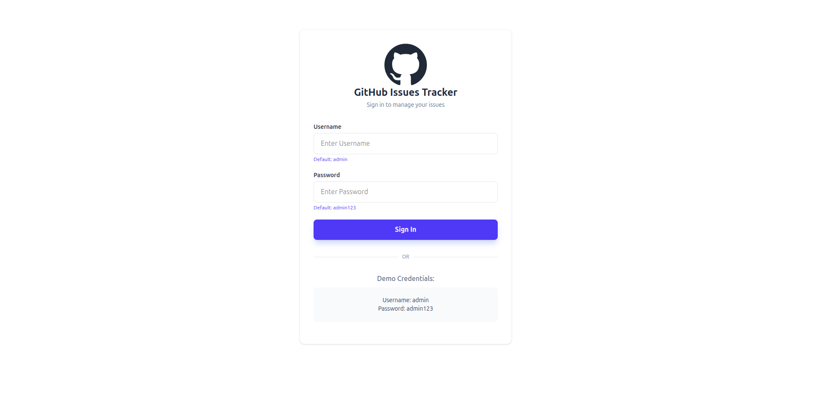
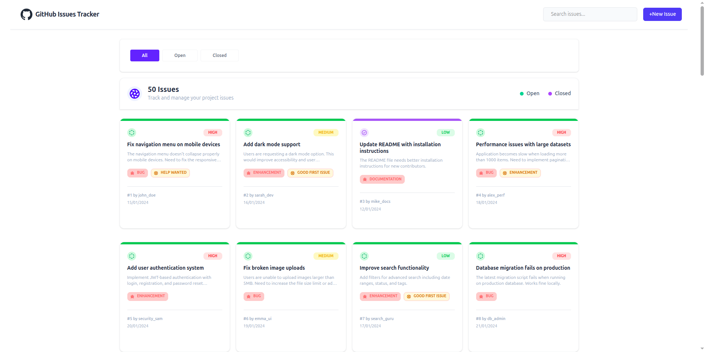
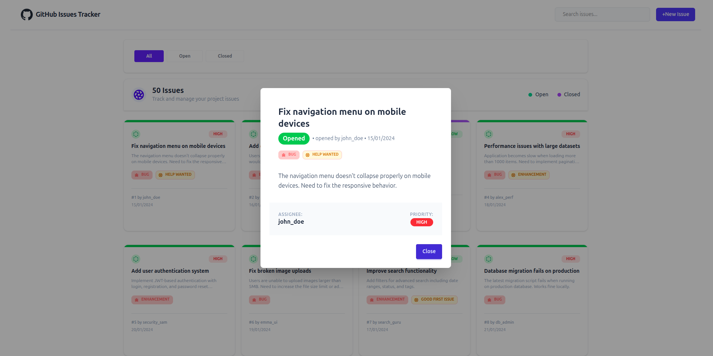
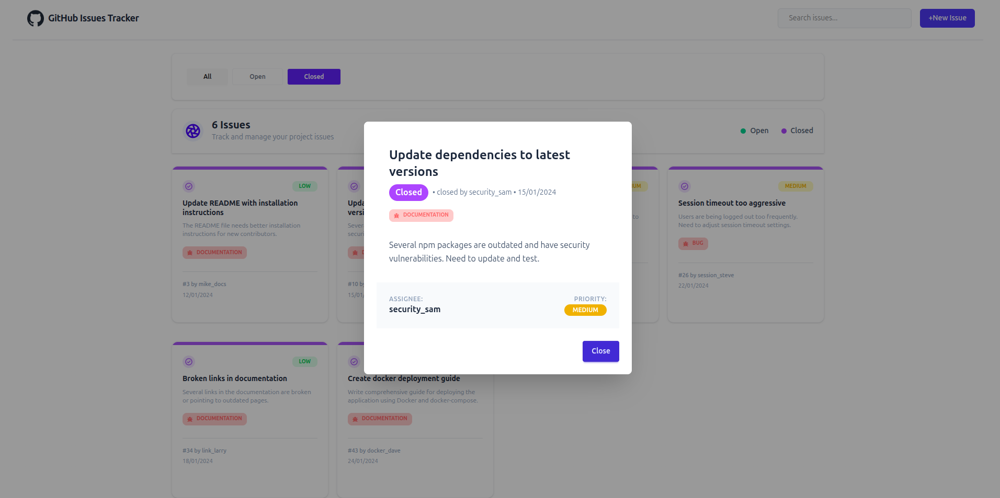

# 🐙 GitHub Issues Tracker

  
  
  
  

**🌐 Live Demo:** https://github-issue-tracker-kouser.netlify.app/  
**📦 Repo Link:** https://github.com/kouser-ahamed/B13-A5-Github-Issue-Tracker-Kouser

---

## 💡 Project Overview

GitHub Issues Tracker is a **responsive web application** that helps users track, manage, and explore issues similar to how GitHub does.

- 🗃️ **Track Issues:** Users can filter, search, and review issues.  
- 🟢 **Open / Closed Status:** View status clearly with color indicators.  
- 🔍 **Search Functionality:** Search through issues by keywords.  
- 📋 **Issue Details Modal:** View detailed information inside a modal popup.  
- ✨ **Responsive & Interactive UI:** Designed with Tailwind CSS and DaisyUI.

---

## 🛠️ Technologies Used

- 💻 **HTML5** – Markup for structure and content  
- 🖼️ **Tailwind CSS & DaisyUI** – Responsive and stylish UI  
- ☕ **JavaScript (ES6+)** – Dynamic behavior & DOM manipulation  
- 📡 **Fetch API** – Fetch issues data from server  
- 🎨 **Font Awesome** – Icon library for labels and UI elements

---

## 📌 Core Features

### 🟢 Issue Filtering

- Filter between **All**, **Open**, and **Closed** issues  
- Active button highlights for better UX

### 🔍 Search Issues

- Search by keyword using the input field  
- Updates card list in real-time

### 📋 Issue Cards

- Each card shows:
  - Status (open / closed)
  - Title, description (short)
  - Labels with icons (bug 🐛, support 🛟)
  - Priority badges
  - Author and date

### 📦 Modal Details

- Clicking a card opens a modal
- Shows full issue details:
  - Status
  - Title
  - Priority
  - Labels
  - Description
  - Author

### ⏱️ Loading Spinner

- Spinner shows while data is being fetched

---

## 🔧 Local Setup Guide

📂 **1. Clone the repository**  
```bash
git clone https://github.com/kouser-ahamed/B13-A5-Github-Issue-Tracker-Kouser.git
````

📁 **2. Navigate to project folder**

```bash
cd B13-A5-Github-Issue-Tracker-Kouser
```

📥 **3. Open `index.html`**
There’s **no server needed** — you can directly open `index.html` in the browser.

🌐 **4. Browser Preview**
Right‑click → **Open with Live Server** (VS Code) or double‑click file to launch demo.

📌 *Optional:* If you want live reload via VS Code → use the **Live Server** extension.

---

## 🧑‍💻 Demo Credentials

✔️ Username: `admin`
✔️ Password: `admin123`

> Use these on the login screen to enter the dashboard.

---

## 🎓 What You’ll Learn

By building or studying this project, you will learn:

* 🔄 **DOM Manipulation:** Dynamically update UI using JS
* 📡 **Async Data Fetching:** Load data using fetch & async/await
* 🧠 **Event Handling:** Button filters, search, modal triggers
* 🧩 **Reusable UI Patterns:** Cards, badges, and modals
* 📱 **Responsive Design:** Using Tailwind + DaisyUI

---

## 💬 JavaScript Q&A (Quick Reference)

### 1. What is the difference between var, let, and const?

1. **var** – Older way to declare variable (function scoped).
2. **let** – Block scoped variable (modern).
3. **const** – Block scoped constant (cannot be reassigned).

---

### 2. What is the spread operator `...`?

The spread operator can copy or expand arrays/objects.

Example:

```javascript
const numbers = [1, 2, 3];
const newNumbers = [...numbers, 4, 5];
```

---

### 3. Difference between map(), filter(), and forEach()?

* **map()** → Returns new array after applying function.
* **filter()** → Returns a new array with filtered elements.
* **forEach()** → Runs function on each element, returns nothing.

---

### 4. What is an arrow function?

Arrow function is a concise syntax to define functions:

```javascript
const add = (a, b) => a + b;
```

---

### 5. What are template literals?

Template literals allow embedding variables in strings:

```javascript
const name = "Rahim";
const message = `Hello ${name}`;
```

---

## 📌 Notes

✅ You don’t need a backend — this project uses an external API.
✅ Just opening HTML files locally is enough for most features.

---

## 🔗 Links

* 🗂️ Repo → [https://github.com/kouser-ahamed/B13-A5-Github-Issue-Tracker-Kouser](https://github.com/kouser-ahamed/B13-A5-Github-Issue-Tracker-Kouser)
* 🌐 Live → [https://github-issue-tracker-kouser.netlify.app/](https://github-issue-tracker-kouser.netlify.app/)

---
